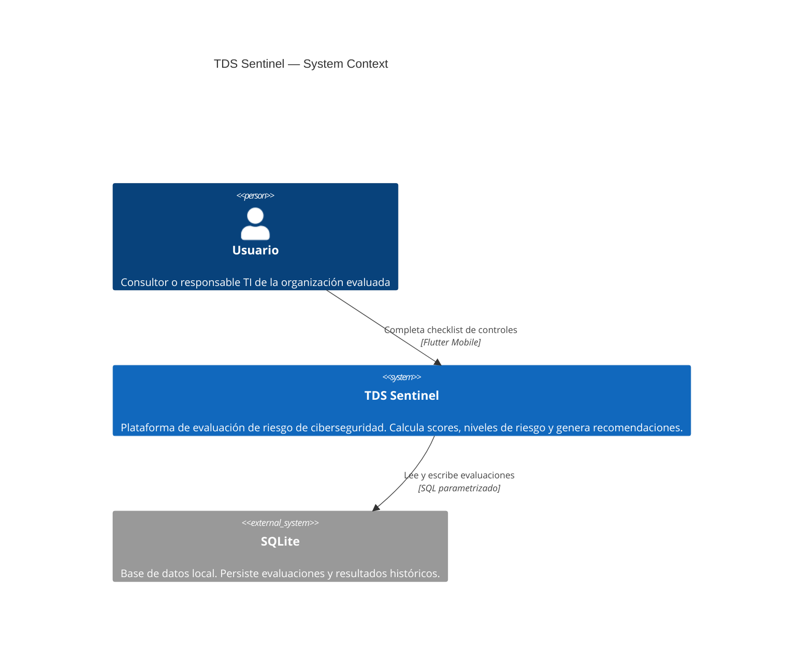
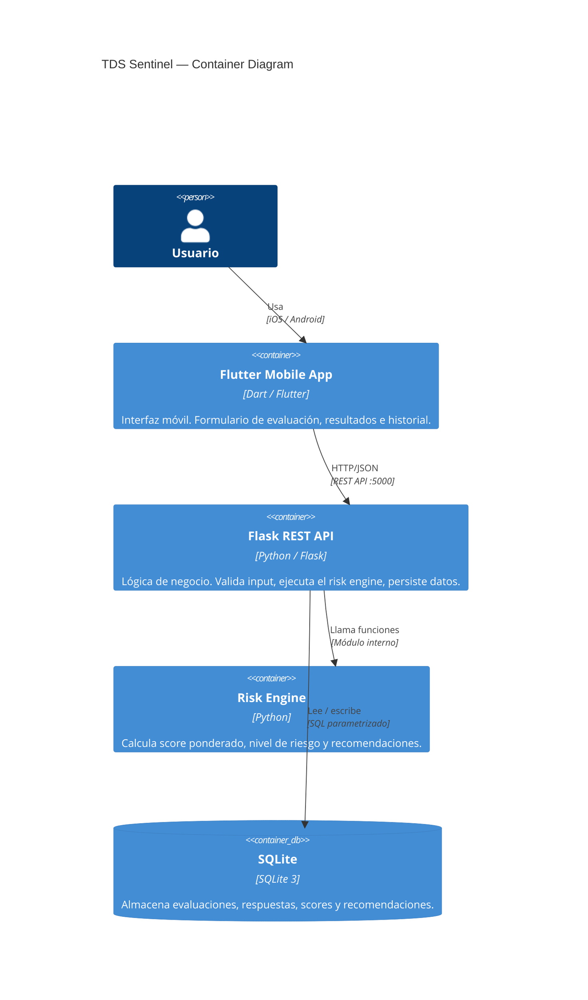

# TDS Sentinel — System Context

## Descripción del sistema

TDS Sentinel evalúa el nivel de riesgo de ciberseguridad de organizaciones mediante cuestionarios de controles ponderados (Assessment Packs). El resultado es un score numérico, un nivel de riesgo y recomendaciones priorizadas.

## Diagrama de contexto

## Diagrama de contenedores

## Decisiones de arquitectura

### ¿Por qué Assessment Packs en código?

Para el MVP académico, los packs viven en `risk_engine.py` como diccionarios Python. Esta decisión:

- Simplifica el desarrollo inicial
- Elimina la necesidad de migraciones de datos
- Permite iterar rápido sobre preguntas y pesos

La arquitectura permite mover los packs a una tabla `assessment_packs` en SQLite sin cambiar la interfaz pública del módulo.

### ¿Por qué SQLite?

- Sin dependencias externas
- Suficiente para un MVP con carga baja
- El schema está versionado (`schema_version`) para facilitar migración futura a PostgreSQL

### ¿Por qué SHA-256 en las evaluaciones?

`assessment_hash` es un hash de integridad, no de seguridad de contraseña. Permite:
- Verificar que el registro no fue alterado
- Usar como referencia única de la evaluación
- Detectar duplicados exactos

No usa salt porque su propósito es referencia, no autenticación.
